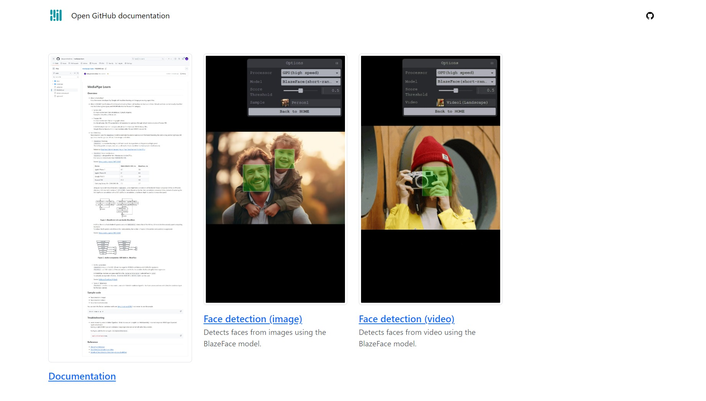
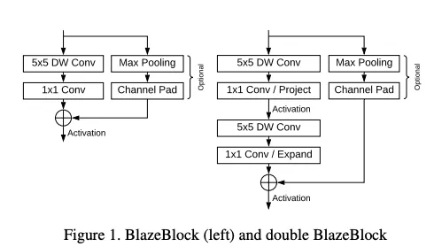
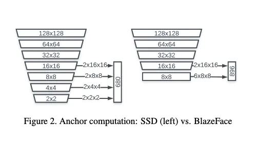

# MediaPipe Learn

This is the learning result of MediaPipe.   
Check out the latest MediaPipe browser demo [here](https://takuya-motoshima.github.io/mediapipe-learn/).    
The code for those browser demos can be found [here](https://github.com/takuya-motoshima/mediapipe-learn/tree/main/docs).  



## Overview
- What is MediaPipe?  
    It is a framework developed by Google with machine learning and image processing capabilities.
- What is WASM? 
    Specification of stack-based virtual machines and the binaries that run in them. Virtual machines can be broadly classified into the following two types, and WASM falls into the Process VM category.  
    - System VM  
        A virtual environment that simulates a physical computer.  
        Examples: VirtualBox, VMware, etc.
    - Process VM  
        A virtual environment for running applications.  
        In a broad sense, the OS's presentation of resources to a process through virtual memory is also a Process VM.

        A WASM virtual machine is simply a virtual machine that runs `WASM binary files.  
        Google Chrome has a built-in virtual machine called V8, and WASM runs on V8.
- Face Detection.  
    Face detection uses the `BlazeFace` model to estimate the position and score of the facial Bounding Box and six key points (right eye, left eye, nose, mouth, right ear, left ear) from images and video.

    - `BlazeFace` Overview.  
        `BlazeFace` is a machine learning model that detects facial position and keypoints at high speed.  
        The six key points are eyes, nose, ears, and mouth. It can also detect multiple people simultaneously.

        Reference: [BlazeFace: Sub-millisecond Neural Face Detection on Mobile GPUs](https://arxiv.org/abs/1907.05047?source=post_page-----e851c348a32b--------------------------------)
    - `BlazeFace` Model Architecture.  
        `BlazeFace` is designed for fast inference on mobile GPUs.  
        It is nearly 2.3 times faster than `MobileNetV2-SSD`.  

        Source: [https://arxiv.org/abs/1907.05047](https://arxiv.org/abs/1907.05047)

        <table>
            <thead>
                <tr><th>Device</th><th>MobileNetV2-SSD, ms</th><th>BlazeFace, ms</th></tr>
            </thead>
            <tbody>
                <tr><td>Apple iPhone 7</td><td>4.2</td><td>1.8</td></tr>
                <tr><td>Apple iPhone XS</td><td>2.1</td><td>0.6</td></tr>
                <tr><td>Google Pixel 3</td><td>7.2</td><td>3.4</td></tr>
                <tr><td>Huawei P20</td><td>21.3</td><td>5.8</td></tr>
                <tr><td>Samsung Galaxy S9+ (SM-G965U1)</td><td>7.2</td><td>3.7</td></tr>
            </tbody>
        </table>

        Using an improved network based on `MobileNet`, a 3x3 depthwise convolution of 56x56x128 Tensor consumes 0.07ms on iPhoneX, whereas a 1x1 channel direction of `128 to 128` channel Based on the fact that convolution consumes 0.3ms, instead of replacing the 3x3 depthwise convolution with a 5x5 depthwise convolution, a shallower depth is used to increase the speed.  

        

        In GPUs, there is a fixed shader Dispatch cost, and `MobileNetV1` shows that of the 4.9 ms, 3.9 ms is the time actually spent computing the kernel.  
        To reduce the Dispatch cost of the anchor computation, the number of layers in the anchor computation is suppressed.  

        Source: [https://arxiv.org/abs/1907.05047](https://arxiv.org/abs/1907.05047)

        
    - Anchor generation.  
        `BlazeFace`'s input is (1,3,128,128) and its output is (1,896,1) confidence and (1,896,16) regression.  
        `BlazeFace` is an SSD-based architecture and requires Anchor to calculate the BoundingBox from regression.  

        In MediaPipe, Anchors are generated from the `SsdAnchorsCalculator` node defined in `pbtxt`.  
        To calculate an equivalent Anchor, `BlazeFace-Pytorch`'s `Anchors.ipynb` can be used.

        Source: [hollance/BlazeFace-PyTorch](https://github.com/hollance/BlazeFace-PyTorch/blob/master/Anchors.ipynb?source=post_page-----e851c348a32b--------------------------------)
    - Types of `BlazeFace`.  
        `BlazeFace` is available in two models, one with 128x128 resolution input for the front camera and one with 256x256 resolution input for the back camera.

## Sample code
- Face detection (image)
- Face detection (video)
- Facial landmark detection

You can start the Docker container and open [http://localhost:8080/](http://localhost:8080/) in a browser to see the sample.
```sh
docker-compose up -d
```

## Troubleshooting
- wasm streaming compile failed: TypeError: Failed to execute 'compile' on 'WebAssembly': Incorrect response MIME type. Expected 'application/wasm'.  
    Adding a `WASM` MIME type and extension mapping to the web server will solve this problem.  

    For Nginx, add the following to `/etc/nginx/mime.types`.
    ```nginx
    application/wasm wasm;
    ```

## Reference
- [MediaPipe Reference](https://developers.google.com/mediapipe/api/solutions/js/tasks-vision)
- [Face Detection Sample from Video](https://developers.google.com/mediapipe/solutions/vision/face_detector/web_js#video)
- [Sample of face detection from image/video (CodePen)](https://codepen.io/mediapipe-preview/pen/OJByWQr)
<!-- - [Detailed description of the BlazeFace model (Japanese)](https://medium.com/axinc/blazeface-%E9%A1%94%E3%81%AE%E4%BD%8D%E7%BD%AE%E3%81%A8%E3%82%AD%E3%83%BC%E3%83%9D%E3%82%A4%E3%83%B3%E3%83%88%E3%82%92%E9%AB%98%E9%80%9F%E3%81%AB%E6%A4%9C%E5%87%BA%E3%81%99%E3%82%8B%E6%A9%9F%E6%A2%B0%E5%AD%A6%E7%BF%92%E3%83%A2%E3%83%87%E3%83%AB-e851c348a32b) -->

## Author
**Takuya Motoshima**

* [github/takuya-motoshima](https://github.com/takuya-motoshima)
* [twitter/TakuyaMotoshima](https://twitter.com/TakuyaMotoshima)
* [facebook/takuya.motoshima.7](https://www.facebook.com/takuya.motoshima.7)

## License
[MIT](LICENSE)